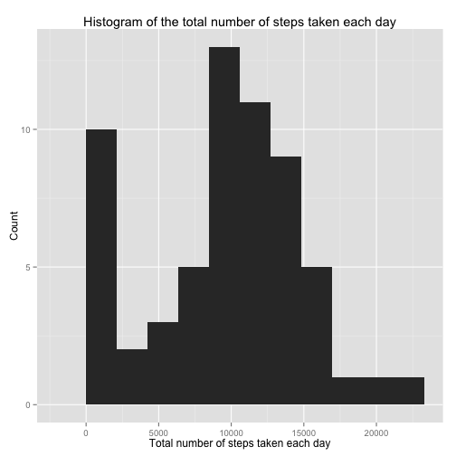
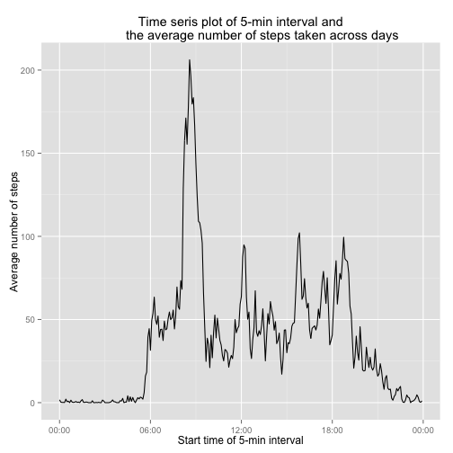
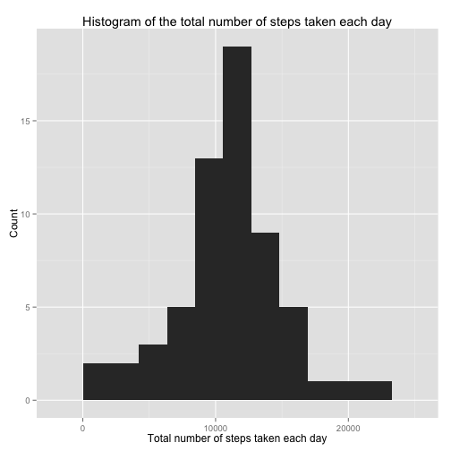
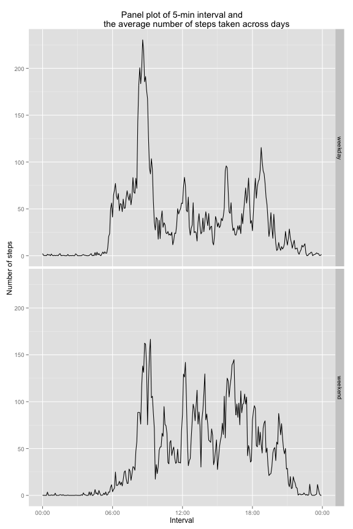

# Reproducible Research: Peer Assessment 1


## Loading and preprocessing the data

```r
## Loading the data
activity <- read.csv(unz("activity.zip", "activity.csv"),
                     stringsAsFactors = FALSE)
## Converting date column to Date class object
activity$date <- as.Date(activity$date, format="%Y-%m-%d")
```


## What is mean total number of steps taken per day?

```r
library(ggplot2)
dailysteps <- tapply(activity$steps, INDEX = activity$date,
                     FUN = sum, na.rm=TRUE)
steps_range <- diff(range(dailysteps))
ggplot(data.frame(dailysteps), aes(dailysteps)) +
    geom_histogram(binwidth=steps_range/10) +
    ggtitle("Histogram of the total number of steps taken each day") +
    xlab("Total number of steps taken each day") +
    ylab("Count")
```

 

```r
dailysteps_mean <- mean(dailysteps)
dailysteps_median <- median(dailysteps)
```
The mean total number of steps taken per day is 9354.2295.
The median total number of steps taken per day is 10395.


## What is the average daily activity pattern?

```r
library(scales)
avg_steps <- tapply(activity$steps, INDEX = activity$interval,
                    FUN = mean, na.rm=TRUE)
five_min_int <- as.integer(names(avg_steps))
five_min_int <- strptime(paste(as.character(floor(five_min_int/100)),
                                as.character(five_min_int %% 100), sep=":"),
                          format = "%H:%M")
ggplot(data.frame(five_min_int, avg_steps), aes(five_min_int, avg_steps)) +
    geom_line() +
    ggtitle("Time seris plot of 5-min interval and
            the average number of steps taken across days") +
    xlab("Start time of 5-min interval") +
    scale_x_datetime(labels = date_format("%H:%M")) +
    ylab("Average number of steps") 
```

 

```r
five_min_int_peak <- strftime(five_min_int[which.max(avg_steps)], format="%H:%M")
```
The 5-minute interval, on average across all the days in the dataset, containing the maximum number of steps starts at 08:35.

## Imputing missing values

```r
colSums(is.na(activity))
```

```
##    steps     date interval 
##     2304        0        0
```

```r
nmiss <- sum(is.na(activity$steps))
table(activity$date[is.na(activity$steps)])
```

```
## 
## 2012-10-01 2012-10-08 2012-11-01 2012-11-04 2012-11-09 2012-11-10 
##        288        288        288        288        288        288 
## 2012-11-14 2012-11-30 
##        288        288
```

```r
days_miss <- names(table(activity$date[is.na(activity$steps)]))
```

There are 2304 missing values in the dataset. 
All the 5-min interval data are missing in these 8 days: 2012-10-01, 2012-10-08, 2012-11-01, 2012-11-04, 2012-11-09, 2012-11-10, 2012-11-14, 2012-11-30.

To impute the missing data, we can fill them in with the mean for that 5-minute interval across all other days.


```r
for (i in seq_along(avg_steps)) {
    activity$steps[is.na(activity$steps) &
                       activity$interval==as.integer(names(avg_steps[i]))] <- avg_steps[i]
}
dailysteps <- tapply(activity$steps, INDEX = activity$date,
                     FUN = sum, na.rm=TRUE)
steps_range <- diff(range(dailysteps))
ggplot(data.frame(dailysteps), aes(dailysteps)) +
    geom_histogram(binwidth=steps_range/10) +
    ggtitle("Histogram of the total number of steps taken each day") +
    xlab("Total number of steps taken each day") +
    ylab("Count")
```

 

```r
dailysteps_mean <- mean(dailysteps)
dailysteps_median <- median(dailysteps)
```
The mean total number of steps taken per day after imputing is 1.0766 &times; 10<sup>4</sup>.
The median total number of steps taken per day after imputing is 1.0766 &times; 10<sup>4</sup>.

These values are higher than the estimates from the first part before imputing. This is because the missing data are in all the 5-min interval of 8 days and making these 8 days having a total number of steps being 0. Hence, the impact of missing values is dragging down the mean and median.


## Are there differences in activity patterns between weekdays and weekends?

```r
activity$day <- as.factor(ifelse(weekdays(activity$date)=="Saturday" |
                                     weekdays(activity$date)=="Sunday", "weekend", "weekday"))
avg_steps <- tapply(activity$steps, INDEX = list(activity$interval, activity$day),
                    FUN = mean, na.rm=TRUE)
five_min_int <- as.integer(dimnames(avg_steps)[[1]])
five_min_int <- strptime(paste(as.character(floor(five_min_int/100)),
                                as.character(five_min_int %% 100), sep=":"),
                          format = "%H:%M")
df1 <- data.frame(five_min_int=five_min_int, 
                  avg_steps=avg_steps[,1],
                  day=as.character(rep(dimnames(avg_steps)[[2]][1], dim(avg_steps)[1])))
df2 <- data.frame(five_min_int=five_min_int, 
                  avg_steps=avg_steps[,2],
                  day=as.character(rep(dimnames(avg_steps)[[2]][2], dim(avg_steps)[1])))
df <- rbind(df1, df2)
ggplot(df, aes(five_min_int, avg_steps)) +
    facet_grid(day ~ .) +
    geom_line() +
    ggtitle("Panel plot of 5-min interval and
            the average number of steps taken across days") +
    xlab("Interval") +
    scale_x_datetime(labels = date_format("%H:%M")) +
    ylab("Number of steps") 
```

 
